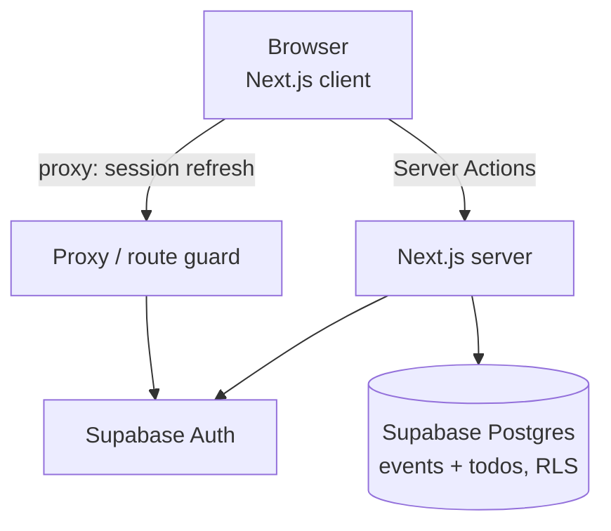
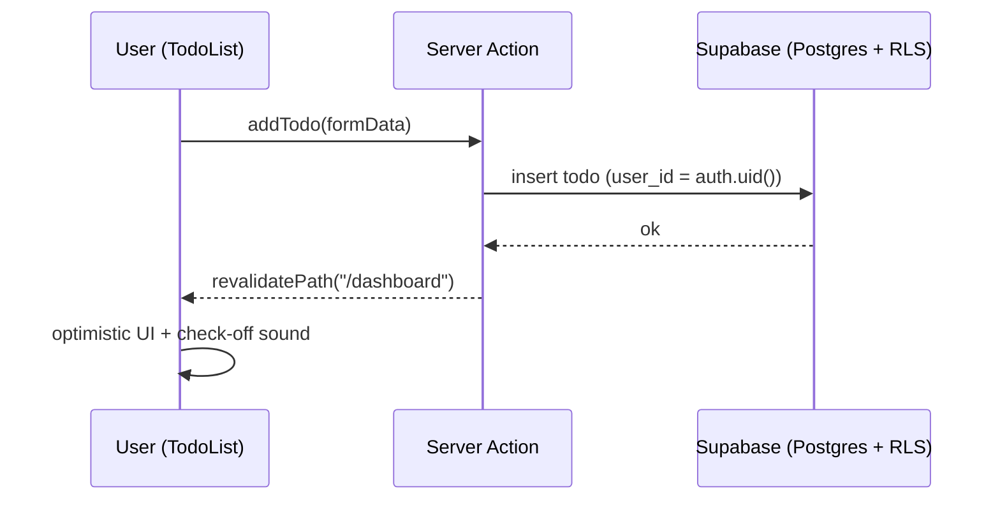

# Luce — A Minimalist Personal Command Center

_luce_ (Italian) — **light.** A calm, dark-mode-only web app that acts as your personal **command center**: a calendar for the things that matter, to-do lists with a satisfying check-off sound, and room for an interactive 3D centerpiece. Everything important, in one quiet place.

---

## Visuals

> The gallery below will be filled with screenshots and a short demo GIF once they are captured.
>
> Suggested shots:
> 1. Landing / hero with the glowing centerpiece
> 2. Login & register screens
> 3. Dashboard with the calendar panel
> 4. To-do list with a checked-off task

---

## Why this project exists

Notes, reminders and to-dos usually end up scattered across sticky notes, phone apps and half-forgotten documents. Luce brings them together into a single, deliberately minimal space that is calm to look at and quick to use.

The design principles are simple:

- **Dark by design.** One theme, tuned for low-light focus — no theme toggle, no distraction.
- **Minimal surface, maximum whitespace.** Only what matters is on screen.
- **Small moments of delight.** A soft sound when you check something off; a gentle glow in the background.
- **Yours only.** Data is scoped per user with row-level security, so you see only your own calendar and tasks.

---

## Core features

| Feature | Description |
|---------|-------------|
| Authentication | Email + password sign-up and login via Supabase, with a session-refreshing proxy that guards private routes. |
| Dashboard | A single command center with a centered, full-screen menu-overlay navigation and an ambient light backdrop. |
| Calendar | A Monday-first monthly calendar; click any day to add or remove events and notes. |
| To-do lists | Add, complete and delete tasks with optimistic UI and a live "remaining" count. |
| Check-off sound | A confirmation sound plays when a task is checked, with a synthesized fallback until a custom audio file is added. |
| Graceful setup | If Supabase keys are missing, the app shows a friendly setup notice instead of crashing. |
| 3D-ready | A placeholder centerpiece is wired in, ready to be swapped for an interactive Spline scene. |

---

## Tech stack

| Layer | Technology |
|-------|------------|
| Framework | Next.js 16 (App Router) |
| Language | TypeScript |
| UI / styling | Tailwind CSS v4 |
| Runtime | React 19 |
| Auth + database | Supabase (`@supabase/ssr`, `@supabase/supabase-js`) |
| Sound | Web Audio API (with an audio-file fallback path) |
| 3D (planned) | Spline (`@splinetool/react-spline`) |

---

## Architecture

### High-level view



### Request flow (adding a task)



The app follows the **Next.js App Router** structure:

- `src/app/` — routes: landing (`page.tsx`), `login/`, `register/`, and the protected `dashboard/`.
- `src/app/auth/actions.ts` — server actions for login, register and sign-out.
- `src/app/dashboard/actions.ts` — server actions for events and todos.
- `src/components/` — UI building blocks (`Calendar`, `TodoList`, `MenuOverlay`, `AuthForm`, `BlobPlaceholder`, ...).
- `src/lib/supabase/` — browser and server Supabase clients plus the session-refresh helper.
- `src/proxy.ts` — refreshes the session on every request and redirects unauthenticated users away from `/dashboard`.
- `supabase/schema.sql` — database schema and row-level security policies.

---

## Data model

Two tables, both protected by row-level security so each user can only read and write their own rows (`auth.uid() = user_id`).

| Table | Columns | Purpose |
|-------|---------|---------|
| `events` | `id`, `user_id`, `event_date`, `title`, `note`, `created_at` | Calendar entries, one or more per day. |
| `todos` | `id`, `user_id`, `title`, `done`, `created_at` | To-do items with a completion flag. |

The full schema, including indexes and RLS policies, lives in [`supabase/schema.sql`](supabase/schema.sql).

---

## Getting started

### Prerequisites

- Node.js 20+ (tested on Node 22)
- npm
- A free [Supabase](https://supabase.com) project

### 1. Install dependencies

```bash
npm install
```

### 2. Configure environment

Copy the example file and fill in the keys from **Supabase → Project Settings → API**:

```bash
cp .env.example .env.local
```

```bash
NEXT_PUBLIC_SUPABASE_URL=...
NEXT_PUBLIC_SUPABASE_ANON_KEY=...
```

### 3. Create the database

In the Supabase dashboard, open the **SQL Editor**, paste the contents of
[`supabase/schema.sql`](supabase/schema.sql) and run it. This creates the
`events` and `todos` tables together with their RLS policies.

### 4. Run the app

```bash
npm run dev
```

Open [http://localhost:3000](http://localhost:3000), create an account and you're in.

### Useful scripts

```bash
npm run dev     # start the dev server
npm run build   # production build
npm run start   # run the production build
npm run lint    # lint the project
```

---

## Project structure

```
luce/
├── src/
│   ├── app/
│   │   ├── page.tsx            # landing / hero
│   │   ├── login/              # login screen
│   │   ├── register/           # register screen
│   │   ├── auth/actions.ts     # login / register / sign-out actions
│   │   └── dashboard/          # protected command center
│   │       ├── layout.tsx      # header, menu, auth guard
│   │       ├── page.tsx        # calendar + to-do panels
│   │       └── actions.ts      # event / todo server actions
│   ├── components/             # Calendar, TodoList, MenuOverlay, Logo, ...
│   ├── lib/
│   │   ├── supabase/           # browser + server clients, session helper
│   │   ├── types.ts            # shared types
│   │   └── useCheckSound.ts    # check-off sound hook
│   └── proxy.ts                # session refresh + route guard
├── supabase/schema.sql         # tables + row-level security
├── public/sounds/              # drop check.mp3 here
└── README.md
```

---

## Roadmap

The project is built in stages. Stages 0–5 are complete.

- [x] **Stage 0 — Setup.** Next.js + TypeScript + Tailwind, git repo, README.
- [x] **Stage 1 — UI foundation.** Dark-mode-only design system, minimalist hero.
- [x] **Stage 2 — Auth.** Supabase login/register, protected dashboard, graceful setup notice.
- [x] **Stage 3 — Dashboard.** Menu-overlay navigation and ambient light backdrop.
- [x] **Stage 4 — Calendar.** DB schema with RLS, monthly calendar with per-day events.
- [x] **Stage 5 — To-do + sound.** Optimistic to-do lists with a check-off sound.
- [ ] **Stage 6 — Spline 3D.** Replace the placeholder centerpiece with an interactive Spline scene.

### Future improvements

- Swap the `BlobPlaceholder` for a real Spline scene (`@splinetool/react-spline`).
- Add a custom `public/sounds/check.mp3` in place of the synthesized tick.
- Recurring events and reminders.
- Drag-to-reorder for to-do items.
- CI for automated linting and builds.

---

## License

This project is released under the MIT License. See [LICENSE](LICENSE) for details.

---

## Acknowledgments

Built by **BobbiJohnson03**. Visual inspiration from [junhyungpark.com](https://junhyungpark.com/).
